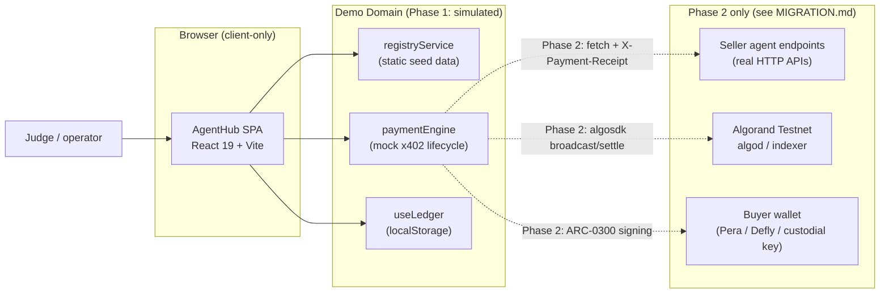
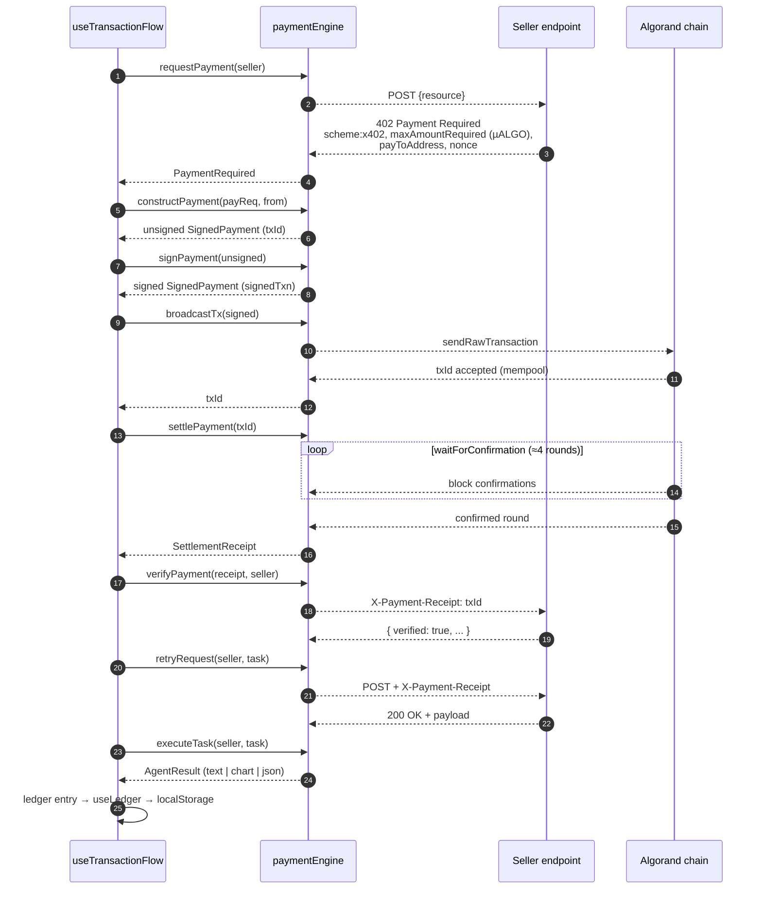
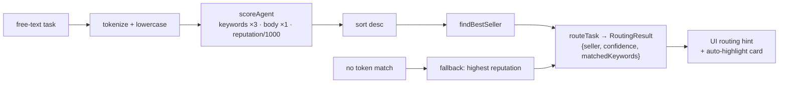
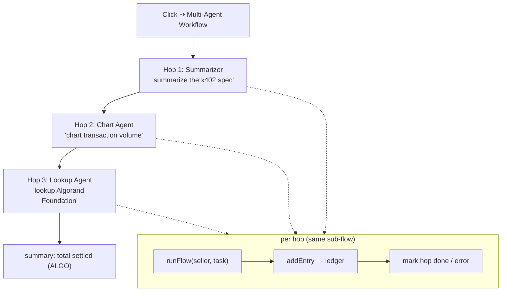
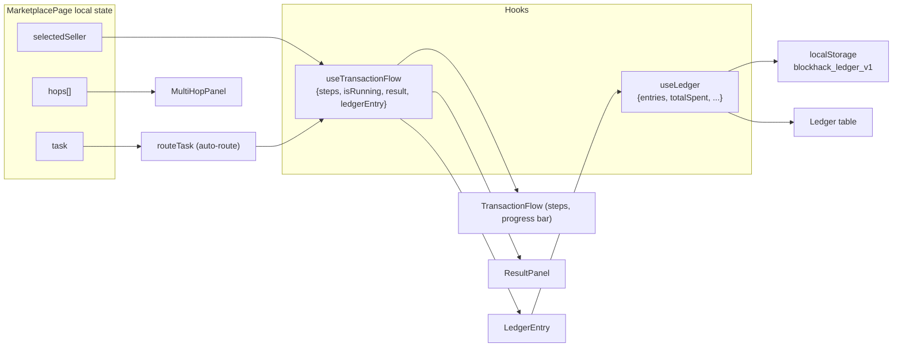
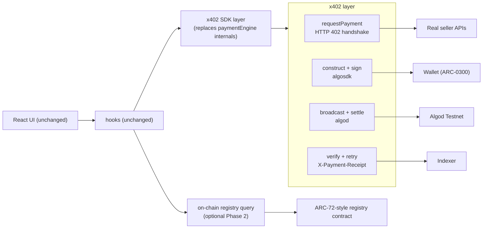

# Architecture — AgentHub x402 Service Registry

This document describes the architecture of the Phase 1 (simulated) demo and how
it maps to the Phase 2 real-network target. All diagrams are Mermaid and render
natively on GitHub.

---

## 1. System context



**Key property:** the SPA never talks to any network today. Every network call
in Phase 2 plugs into `paymentEngine` without touching React.

---

## 2. Package / module layout

```mermaid
flowchart TB
    subgraph Entry["Entry"]
        main["main.tsx"] --> App["App.tsx"]
    end

    App --> Page["MarketplacePage.tsx"]
    Page --> Comp["Components"]
    Page --> Hooks["Hooks"]
    Page --> Srv["Services"]

    subgraph Comp["components/"]
        Header["Header/"]
        Market["Marketplace/<br/>SellerCard"]
        Flow["TransactionFlow/<br/>ResultPanel"]
        Multi["Timeline/MultiHopPanel"]
        Ledger["Ledger/"]
    end

    subgraph Hooks["hooks/"]
        HookFlow["useTransactionFlow<br/>orchestrates step sequence"]
        HookLedger["useLedger<br/>localStorage persistence"]
    end

    subgraph Srv["services/"]
        Registry["registryService<br/>load / search / rank"]
        Router["agentRouter<br/>task → seller"]
        Engine["paymentEngine<br/>8-step x402 lifecycle"]
    end

    subgraph Data["data/"]
        Agents["agents.ts<br/>SELLER_AGENTS · BUYER_AGENT"]
    end

    subgraph Types["types/"]
        Types["index.ts<br/>shared contracts"]
    end

    Registry --> Data
    Router --> Registry
    Engine --> Types
    Hooks --> Srv
    Hooks --> Types
    Comp --> Types
    Comp --> Utils["utils/format.ts"]
```

**Ownership rule:** arrows point *down*; nothing at a lower layer may import
upward. Components never call services directly for orchestration — the page
wires hooks, hooks call services, services are pure.

---

## 3. x402 payment lifecycle (the heart of the app)

`useTransactionFlow.runFlow(seller, task)` drives 14 UI steps backed by 8
engine calls. The engine internals are mocked; the lifecycle is the real x402
protocol:



---

## 4. Task routing



Scoring is deterministic and pure (`registryService.ts`), which makes it easy to
unit-test without a mock layer.

---

## 5. Multi-agent workflow

`MarketplacePage.handleRunMultiHop` reuses `runFlow` per hop in sequence:



The multi-hop panel renders one `HopCard` per step with status, price,
confirmation duration, and truncated TX hash.

---

## 6. State & data flow



`useLedger` owns `blockhack_ledger_v1` — no other module touches the storage
key, so a future swap to a real indexer/backend ledger is a one-hook change.

---

## 7. Target architecture (Phase 2, post-migration)



---

## 8. Design invariants

1. **Types are the API.** All contracts live in `src/types/index.ts`; feature
   modules may not define their own domain types.
2. **Pure core, animated shell.** `services/` are pure/async-with-delay; all UI
   state lives in hooks; components are presentational.
3. **Deterministic data.** `agents.ts` is the single seed source; adding a
   seller means touching exactly one file.
4. **Simulation is honest.** `NetworkMode = 'simulated' | 'testnet' | 'mainnet'`
   is typed end-to-end so flipping to testnet is a config change, not a
   refactor.
